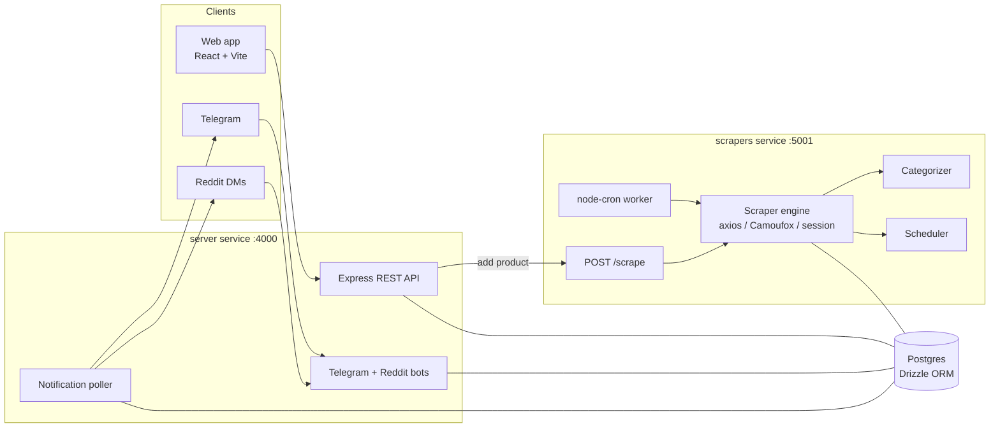

# PriceDrop Detective — Documentation

Real-time price tracking for e-commerce products across 14 Indian stores, with
alerts delivered over the web app, Telegram, and Reddit.

This folder is the **single source of truth** for how the system is built and why.
Every functional change to the codebase should be reflected here (see the
[documentation freshness policy](#documentation-freshness) below).

## Table of contents

| Doc | What it covers |
|-----|----------------|
| [product-overview.md](./product-overview.md) | What the product does, features, notification channels, limits |
| [code-architecture.md](./code-architecture.md) | Monorepo layout, package boundaries, module responsibilities |
| [workflow-architecture.md](./workflow-architecture.md) | Runtime flows: add-a-tracker, scheduled scrape, notification delivery |
| [db-structure.md](./db-structure.md) | Postgres schema, **ER diagram**, migrations, regeneration rule |
| [scrapers.md](./scrapers.md) | Scraper folder layout, `BaseScraper`, the 4 fetch strategies, adding a platform |
| [session-scraper.md](./session-scraper.md) | Camoufox session/cookie scraping to bypass Akamai (AJIO) |
| [categorizer.md](./categorizer.md) | Fuzzy product categorizer: why, how, and how it self-improves |
| [review/](./review/) | Code-review reports written by the `code-reviewer` skill |

## System at a glance

The two Node services (`server`, `scrapers`) share code through the `shared`
package and communicate **only** through Postgres and one HTTP call
(`server → scrapers POST /scrape`). See
[code-architecture.md](./code-architecture.md) for the full breakdown.

##  Documentation freshness policy

**These docs must be updated in the same change that alters the code or behaviour
they describe.** This is enforced two ways:

1. **Copilot instructions** — `.github/copilot-instructions.md` instructs the
   agent to update the relevant `docs/` file whenever it changes functionality.
2. **Copilot CLI hook** — `.github/hooks/docs-freshness.json` runs
   `scripts/docs-hook.js` as a non-blocking `postToolUse` hook (matching the
   `edit` / `create` tools). Whenever the agent edits functional source
   (server / scrapers / shared / web `src`, or the DB schema) it injects a
   reminder — with the likely doc(s) to update — into the session. It is
   **advisory**: pure bug fixes, refactors, and formatting need no doc edits.
   For a manual, staged-changes audit at commit time, run `pnpm docs:check`
   (`scripts/check-docs.js`).

On-demand helpers (Copilot skills, in `.github/skills/`):

- **`doc-updater`** — audit the docs against the current code and update stale parts.
- **`skill-updater`** — refresh a skill (e.g. `scraper-generator`) with the latest project context.
- **`code-reviewer`** — produce a senior-engineer review into `docs/review/`.
- **`review-fixer`** — implement the fixes raised in a `docs/review/` report.

### When you change the DB schema

Regenerate the ER diagram and migration list in
[db-structure.md](./db-structure.md) after editing `shared/src/db/schema.ts`.
