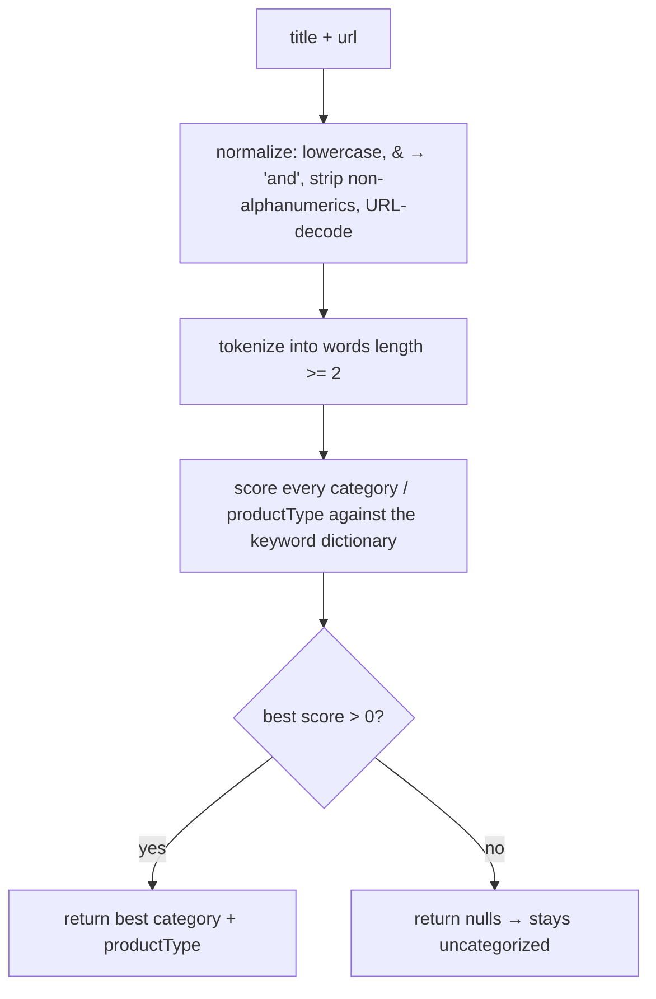
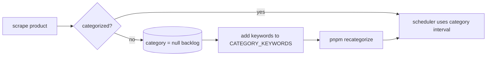

# Product Categorizer

A lightweight, dependency-free **fuzzy keyword categorizer** that labels each
product with a `category` and `productType`. These labels drive **adaptive scrape
frequency** and power analytics/filtering. Code:
`scrapers/src/categorizer.ts` (`ProductCategorizer`) and
`scrapers/src/scheduler.ts` (`ScrapeScheduler`).

## Why categorize?

Different product classes change price at very different rates. Polling
everything at the same cadence is wasteful (books rarely move) or too slow
(electronics move often). Categorization lets the scheduler **spend scrape budget
where prices actually change**:

| Category | Base interval | Rationale |
|----------|---------------|-----------|
| electronics | 600s (10 min) | volatile pricing, flash deals |
| beauty | 3600s (1 h) | moderate |
| home | 3600s (1 h) | moderate |
| fashion | 5400s (1.5 h) | slower churn |
| grocery | 10800s (3 h) | stable, location-gated |
| books | 32400s (9 h) | very stable |
| *(uncategorized)* | 3600s (1 h) default | safe middle ground |

(Base intervals live in `scheduler.ts` `CATEGORY_BASE_INTERVAL`.)

## How it works

`ProductCategorizer.categorize({ title, url, website })` returns
`{ category, productType }` (either may be `null`).



### The keyword dictionary

`CATEGORY_KEYWORDS` is a two-level map: `category → productType → keywords[]`.
Example:

```ts
electronics: {
  phone: ['phone', 'mobile', 'smartphone', 'iphone', 'galaxy', 'redmi', ...],
  laptop: ['laptop', 'notebook', 'macbook', 'thinkpad', ...],
  gpu: ['gpu', 'graphics card', 'geforce', 'rtx', 'radeon'],
  ...
}
```

### Scoring & matching

- Each keyword hit adds to the product-type score; a hit on the **product-type
  name itself** is weighted higher (3 vs 1), so a "laptop" mention beats an
  incidental keyword.
- A category's score is the sum of its product-type scores; the highest-scoring
  category wins, tie-broken by the strongest single product type.
- **Fuzzy matching** (`tokenMatchesKeyword`) tolerates minor variation:
  - exact token match, or
  - substring match for keywords ≥ 5 chars, or
  - **Levenshtein distance ≤ 1** for tokens ≥ 5 chars of similar length
    (catches typos/plurals like `sneaker`/`sneakers`).
- Multi-word keywords (e.g. `"graphics card"`) match as a phrase against the
  normalized text.

If nothing scores above zero, the product is left **uncategorized** (`null`) —
this is a signal, not a failure (see below).

## When categorization happens

1. **At add time** — `POST /scrape` (`http.ts`) categorizes from the scraped
   title/URL and returns `category` so the server stores it on the product.
2. **Lazy backfill during scraping** — the worker (`worker.ts`) re-categorizes any
   product whose `category` is still `null` on each scrape, persisting a label as
   soon as the dictionary can produce one.

## How it improves over time

The design is deliberately a **living dictionary**, not a static model:

1. **Uncategorized products are visible.** Products that score zero keep
   `category = null` in the DB — a queryable backlog of gaps.
2. **Extend the dictionary.** Add the missing keyword(s) under an existing
   product type, or add a new product type/category, in
   `CATEGORY_KEYWORDS`.
3. **Re-categorize retroactively.** Run the backfill script to relabel existing
   uncategorized rows with the improved dictionary:

   ```bash
   pnpm recategorize        # scrapers/scripts/recategorize.ts
   ```

   (The worker also backfills opportunistically on the next scrape.)
4. **Accuracy compounds.** Each iteration shrinks the uncategorized set and
   sharpens scheduling — no retraining, just data edits + a script run.



## Interaction with the scheduler

After each scrape the `ScrapeScheduler` combines the **category base interval**
with **recent price volatility** to set the product's `scrape_interval`:

- price changed within **24h** → interval × **0.5** (poll faster)
- no change in **7 days** → interval × **2** (poll slower)
- otherwise → × 1
- result clamped to **[300s, 43200s]** (5 min – 12 h) and mapped to a coarse
  `priority` tier (`tier1`/`tier2`/`tier3`).

So category sets the *baseline* cadence and price history *modulates* it. See
[workflow-architecture.md](./workflow-architecture.md#2c-adaptive-rescheduling-scrapescheduler).

## Extending — checklist

- [ ] Add/adjust keywords in `CATEGORY_KEYWORDS` (lowercase; product-type name is
      auto-weighted, no need to repeat it in its own list unless helpful).
- [ ] If adding a **new category**, add a matching `CATEGORY_BASE_INTERVAL` entry
      in `scheduler.ts` (otherwise it falls back to the 1h default).
- [ ] Run `pnpm recategorize` to relabel the existing uncategorized backlog.
- [ ] Update this doc's category/interval tables if intervals or categories changed.
