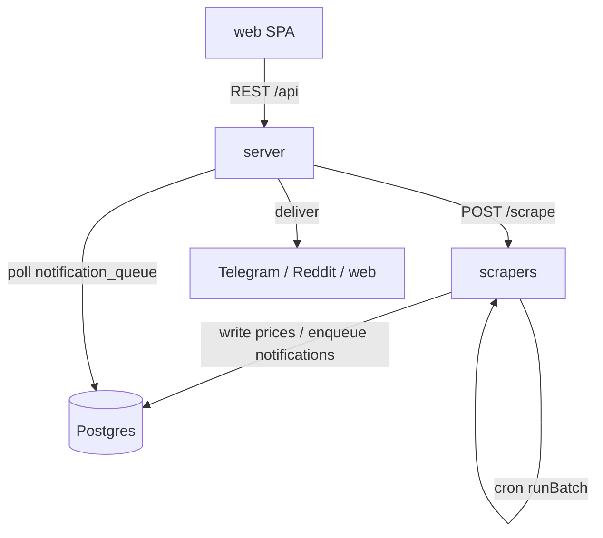

# Code Architecture

PriceDrop Detective is a **pnpm-workspace monorepo** with four packages that
build and deploy from one repository but run as independent units.

```
pricedrop-detective/
├── shared/     @pricedrop/shared  — DB schema, ORM client, domain helpers (imported by server + scrapers)
├── server/     Express REST API + Telegram/Reddit bots + notification poller  (service :4000)
├── scrapers/   Scraper engine + HTTP /scrape + in-process cron worker         (service :5001)
├── web/        React + Vite single-page app (built to static assets)
├── Dockerfile          one image, run with different `command`s per service
├── docker-compose.yml  postgres + migrate + app(server) + scrapers
└── pnpm-workspace.yaml  workspace + native-build allowlist
```

## Why a monorepo

- **One shared domain layer.** `shared` owns the Drizzle schema, the Postgres
  client, and pure helpers (hashing, formatting, limits, error type). Both Node
  services import it as `@pricedrop/shared/*`, so there is exactly one definition
  of every table and type.
- **One Docker image, many roles.** `Dockerfile` installs the whole workspace
  once; `docker-compose.yml` starts the same image three times with different
  commands (`migrate`, `server`, `scrapers`). This keeps dependency versions and
  the Camoufox/Firefox runtime identical across services.
- **Atomic cross-cutting changes.** A schema change plus its server, scraper, and
  web consumers land in a single commit.

## Package responsibilities

### `shared` — `@pricedrop/shared`

The domain core. No HTTP, no scraping.

| Area | Files |
|------|-------|
| Schema & types | `src/db/schema.ts` (Drizzle tables + inferred types) |
| DB client | `src/db/client.ts`, `src/db/migrate.ts` |
| Data access | `src/db/{products,prices,subscriptions,users,lists,notifications,sessions}.ts` |
| Domain helpers | `src/hash.ts`, `src/format.ts`, `src/limits.ts`, `src/error.ts`, `src/enums.ts`, `src/types.ts` |
| Config | `src/config.ts` (loads `.env`) |
| Migrations | `drizzle/*.sql` + `drizzle/meta/` (generated by drizzle-kit) |

`CustomError` (`src/error.ts`) is the project-wide typed error. It carries a
`name` used for control flow (e.g. `PriceNotFound`, `SessionExpired`,
`PlatformNotSupported`), so callers branch on `error.name` rather than string
matching.

### `server` — REST API + bots (service on :4000)

Entry point `server/server.ts`:

- Mounts REST routers under `/api/*`:
  - `auth` (register/login, JWT), `users` (profile + channel linking),
    `products` (read + price history), `subscriptions` (track/untrack + alert
    config), `lists` (grouping + public sharing), `platforms` (supported stores).
- Starts the **Telegram bot** (grammy) and, if configured, the **Reddit DM bot**.
- Starts the **notification poller** (`src/services/notifier.ts`) that drains the
  `notification_queue` outbox and delivers messages.
- Serves the built `web/dist` as static assets when present (production/Docker).

`server` **never scrapes directly**. To add a product it calls the scrapers
service over HTTP via `src/services/scraperClient.ts`
(`SCRAPER_URL`, default `http://scrapers:5001`).

### `scrapers` — scraping engine + worker (service on :5001)

Entry point `scrapers/src/index.ts`:

- Starts an HTTP server (`src/http.ts`) exposing `POST /scrape` (used by the
  server when a user adds a product) and `GET /platforms`.
- Starts an in-process `node-cron` job (default every minute) that runs
  `runBatch()` (`src/worker.ts`) for all **due** products.

Sub-modules:

| Module | Responsibility |
|--------|----------------|
| `src/scraper/` | Per-platform scrapers + `BaseScraper` + fetch strategies. See [scrapers.md](./scrapers.md). |
| `src/scraper/browser.ts` + `session-manager.ts` | Camoufox + session/cookie scraping. See [session-scraper.md](./session-scraper.md). |
| `src/categorizer.ts` | Fuzzy product categorizer. See [categorizer.md](./categorizer.md). |
| `src/scheduler.ts` | Computes per-product scrape interval from category + price history. |
| `src/price-recorder.ts` | Decides whether an observation is stored and what notification it warrants. |
| `src/worker.ts` | Batch orchestrator: select due → scrape → categorize → record → reschedule. |
| `src/detect.ts` | Maps a URL hostname to a platform key. |
| `src/http.ts` | The `/scrape` + `/platforms` HTTP surface. |

### `web` — React + Vite SPA

Talks to the server REST API through `web/src/lib/api.ts`. Auth state in
`web/src/lib/auth.tsx`. Pages: Home (marketing + add), Dashboard, Trackers,
Product (price chart), Lists / SharedList, Settings, Login/Register. Store
branding lives in `StoreBadge.tsx` / `StoreDrawer.tsx` and must be extended when
a new platform is added (see [scrapers.md](./scrapers.md)).

## Communication boundaries

There are exactly **two** integration seams — keep it that way:

1. **Postgres** — the shared source of truth. Both services read/write it through
   `shared`'s data-access functions.
2. **`server → scrapers` HTTP** — a single `POST /scrape` call when a user adds a
   product, so the server gets an immediate first price without embedding the
   browser/Camoufox runtime.

The scheduled re-scraping loop runs entirely inside `scrapers`; results reach the
server (and thus users) through the DB (`notification_queue` → notifier).



## Runtime & tooling

- **Language:** TypeScript, strict mode with `noUncheckedIndexedAccess`
  (indexed access is `T | undefined` — always guard or `!`-assert after a check).
- **Runner:** `tsx` (no build step for the Node services; run `.ts` directly).
- **DB/ORM:** Postgres 18 + Drizzle ORM; migrations via drizzle-kit.
- **Browser:** Camoufox (stealth Firefox) via `camoufox-js`, on an Xvfb virtual
  display in Docker.
- **Tests:** Jest (`jest --config jest.config.ts`) — live scraper integration
  tests in `scrapers/__tests__/`.
- **Formatting:** Prettier — single quotes, ES5 trailing commas, 150-char width.

### Key commands

```bash
pnpm dev            # server with hot reload (tsx watch)
pnpm dev:scrapers   # scrapers service with hot reload
pnpm scrape:worker  # run one scrape batch and exit
pnpm recategorize   # re-run the categorizer over uncategorized products
pnpm typecheck      # tsc --noEmit across the workspace
pnpm test           # jest
pnpm db:generate    # generate a migration from schema.ts changes
pnpm db:migrate     # apply migrations
pnpm docs:check     # warn if functional code changed without docs (used by the pre-commit hook)
```

## Where to make common changes

| Change | Start here | Also update |
|--------|-----------|-------------|
| Add a store/platform | `scrapers/src/scraper/platforms/` | See the [scraper-generator skill](../.github/skills/scraper-generator/SKILL.md) & [scrapers.md](./scrapers.md) |
| Change the DB schema | `shared/src/db/schema.ts` | `pnpm db:generate`, then [db-structure.md](./db-structure.md) |
| Add an API endpoint | `server/src/api/routes/` | `web/src/lib/api.ts`, [workflow-architecture.md](./workflow-architecture.md) |
| Change scrape cadence rules | `scrapers/src/scheduler.ts` | [categorizer.md](./categorizer.md) |
| Change storage/notify rules | `scrapers/src/price-recorder.ts` | [workflow-architecture.md](./workflow-architecture.md) |
