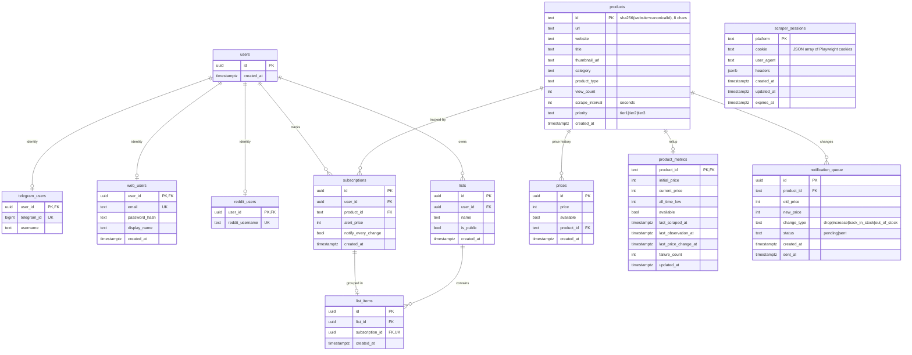

# Database Structure

Postgres 18, modelled with **Drizzle ORM**. The schema lives in
[`shared/src/db/schema.ts`](../shared/src/db/schema.ts) and is the single source
of truth; SQL migrations are generated from it into `shared/drizzle/`.

> **Keep this diagram in sync.** Whenever you edit `schema.ts`, regenerate the
> migration (`pnpm db:generate`) **and** update the ER diagram + table reference
> below. The `doc-updater` skill can do this for you.

## Entity–relationship diagram



> `scraper_sessions` has no foreign keys — it is a per-platform singleton keyed by
> platform name — so it is drawn standalone (not linked in the ER graph above).

## Design notes

### Abstract identity + provider tables

`users` is a **provider-agnostic identity** (just a UUID). Each channel a person
authenticates through gets its own 1:1 provider row referencing `users.id`:

- `telegram_users` (Telegram numeric ID),
- `web_users` (email + bcrypt `password_hash`),
- `reddit_users` (Reddit username).

This lets one identity link multiple channels and lets us add providers without
touching the core tables.

### Shared products, per-user subscriptions

`products` holds **one row per unique product** (`id` = 8-char
`sha256({website, canonicalId})`). `subscriptions` is the many-to-many join
between `users` and `products`, carrying per-user preferences (`alert_price`,
`notify_every_change`). Scraping a product benefits every subscriber at once.

### Append-only prices + a metrics rollup

`prices` is **append-only** price history (ordered by `created_at`; the last row
is the current price). `product_metrics` is a **pre-computed rollup** per product
(`current_price`, `all_time_low`, `initial_price`, availability, and the
timestamps the scheduler/recorder rely on: `last_scraped_at`,
`last_observation_at`, `last_price_change_at`, `failure_count`). Reading metrics
avoids scanning the full price history on every scrape/due-check.

### Lists

`lists` group a user's trackers; `list_items` maps a **subscription** (not a
product) into exactly one list (`subscription_id` is unique). Lists can be public
(`is_public`) for sharing via `/api/lists/:id/public`.

### Notification outbox

`notification_queue` is a **durable outbox**: the scrapers worker inserts
`pending` rows; the server's poller delivers them and flips them to `sent`. The
`(status, created_at)` index drives efficient polling. See
[workflow-architecture.md](./workflow-architecture.md#3-notification-delivery).

### Scraper sessions

`scraper_sessions` stores one reusable WAF session **per platform** (currently
AJIO). `cookie` holds a JSON array of Playwright cookie objects; the session
manager injects them into a fresh Camoufox context to skip re-solving Akamai. See
[session-scraper.md](./session-scraper.md). `user_agent`/`headers` are retained
for the legacy curl replay path and are otherwise vestigial for the render
approach.

## Indexes

| Table | Index | Purpose |
|-------|-------|---------|
| `subscriptions` | `subscriptions_user_idx` (user_id) | list a user's trackers |
| `subscriptions` | `subscriptions_product_idx` (product_id) | fan-out subscribers |
| `prices` | `prices_product_idx` (product_id) | price history per product |
| `prices` | `prices_created_at_idx` (product_id, created_at) | latest / range queries |
| `lists` | `lists_user_idx` (user_id) | a user's lists |
| `lists` | `lists_user_name_uniq` (user_id, name) UNIQUE | no duplicate list names per user |
| `notification_queue` | `notification_queue_status_idx` (status, created_at) | poll pending outbox |

## Migrations

Migrations are generated by drizzle-kit and applied by the `migrate` service
(`tsx shared/src/db/migrate.ts`) before the app/scrapers start.

| # | Tag |
|---|-----|
| 0000 | `aspiring_vulcan` |
| 0001 | `large_changeling` |
| 0002 | `married_odin` |
| 0003 | `lazy_amphibian` |
| 0004 | `familiar_zuras` (adds `scraper_sessions`) |

### Schema change workflow

```bash
# 1. Edit the schema
$EDITOR shared/src/db/schema.ts

# 2. Generate a migration (writes shared/drizzle/NNNN_*.sql + meta snapshot)
pnpm db:generate

# 3. Review the generated SQL, then apply
pnpm db:migrate          # or: docker compose up --build  (migrate service applies it)

# 4. Update docs — regenerate the ER diagram + tables above and bump the list
```

Native-build note: `drizzle-kit`/`camoufox-js` pull `better-sqlite3`, which is
allowlisted for native builds in `pnpm-workspace.yaml` (`allowBuilds`). `.npmrc`
sets `verify-deps-before-run=false` so drizzle-kit runs despite the custom
allowlist (a harmless npm warning is printed).
