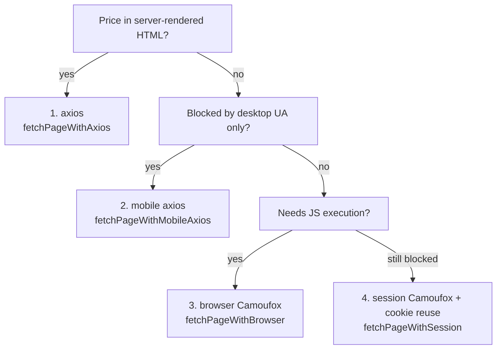

# Scrapers

Everything about turning a product URL into `{ price, title, thumbnail,
available }`. Code lives in `scrapers/src/`.

## Folder layout

```
scrapers/src/
├── index.ts                  Service entry: HTTP server + node-cron worker
├── http.ts                   POST /scrape, GET /platforms, GET /health
├── worker.ts                 runBatch(): select due → scrape → categorize → record → reschedule
├── detect.ts                 URL hostname → platform key (HOSTNAME_MAP)
├── platforms.ts              listPlatforms(): id + display name for the API/web
├── categorizer.ts            Fuzzy product categorizer (see categorizer.md)
├── scheduler.ts              Adaptive scrape-interval computation
├── price-recorder.ts         Store-or-skip + notification decision
├── logger.ts                 Scoped structured logger
└── scraper/
    ├── index.ts              Registry: platform key → scraper instance + scrape()/resolve()
    ├── base.ts               BaseScraper + the 4 fetch strategies
    ├── browser.ts            Camoufox launcher + session render engine
    ├── session-manager.ts    Per-platform session reuse/refresh (AJIO)
    ├── selectors.json        Per-platform metadata (fetchMethod, notes)
    └── platforms/            One file per store (amazon.ts, flipkart.ts, ...)
```

## The scraper contract (`BaseScraper`)

Each platform is a class extending `BaseScraper` (`scraper/base.ts`). The base
provides `scrape(url)` which orchestrates the four steps; subclasses override the
parts that differ:

| Method | Default | Override when |
|--------|---------|---------------|
| `canonicalizeUrl(url)` | origin + pathname | the store has a stable product-id pattern (almost always) |
| `fetchPage(url)` | `fetchPageWithAxios` | the store needs mobile UA / browser / session |
| `extractPrice($)` | — (abstract) | always — parse price as a **positive integer** (₹, no decimals) |
| `extractTitle($)` | — | always — product name string |
| `extractThumbnail($)` | — | recommended — product image URL |

`scrape()` returns `{ currentPrice, title, thumbnailUrl, available }`. On
failure it throws a `CustomError` whose `name` (e.g. `PriceNotFound`) drives
control flow upstream.

## The four fetch strategies

Pick the **cheapest strategy that works**. Order of preference: axios → mobile
axios → browser → session.



### 1. Axios (`fetchPageWithAxios`) — **preferred**

Plain HTTP + cheerio. Fast (~1–3s), no browser, CI-friendly. Works when the price
is in the SSR HTML (JSON-LD, meta tags, inline `__PRELOADED_STATE__`, etc.).
Used by most stores (bigbasket, ikea, croma, decathlon, lenskart, ...).

### 2. Mobile axios (`fetchPageWithMobileAxios(url, 'android' | 'iphone')`)

Same speed as axios but sends an Android/iPhone user-agent. Bypasses WAFs that
only gate on desktop UA. Mobile HTML may use different selectors — test both
devices. Used by e.g. Meesho, Nykaa Fashion.

### 3. Browser (`fetchPageWithBrowser(url, waitUntil)`)

Renders the page in **Camoufox** (stealth Firefox) — see
[session-scraper.md](./session-scraper.md) for the launcher. Use when the price
is only present after JavaScript executes (SPA hydration) or behind an anti-bot
interstitial. `fetchPageWithBrowser` also handles Amazon's "Continue shopping"
interstitial loop. Slow (~10–45s) and memory-heavy; not for high-frequency
polling. `waitUntil` guidance:

- `'domcontentloaded'` — fastest; default.
- `'load'` — waits for resources; rarely needed.
- `'networkidle'` — **avoid** on sites with persistent connections/polling
  (e.g. Blinkit), it never idles and times out.

Used by e.g. Amazon, Blinkit, JioMart.

### 4. Session / cookie-based (`fetchPageWithSession(url, platform)`)

For sites whose WAF (Akamai Bot Manager) rejects **every bare fetch** — even the
browser's own request API. The page is navigated in Camoufox while a previously
**solved cookie set** is injected (and refreshed) to skip re-solving. This is the
"3rd scraping type". Fully documented in
[session-scraper.md](./session-scraper.md). Used by **AJIO**.

Helpers live in `scraper/base.ts`; `browser.ts` + `session-manager.ts` implement
the Camoufox and session mechanics.

## Registration surface — adding a platform

Adding a store touches backend **and** frontend. The
[`scraper-generator` skill](../.github/skills/scraper-generator/SKILL.md)
automates and checklists this. In brief:

1. `scrapers/src/scraper/platforms/{platform}.ts` — the scraper class.
2. `scrapers/src/scraper/selectors.json` — metadata (`fetchMethod`, notes).
3. `scrapers/src/scraper/index.ts` — import + add to the `registry`.
4. `scrapers/src/detect.ts` — add hostname(s) to `HOSTNAME_MAP`.
5. `scrapers/src/worker.ts` — add the key to the `platforms` allow-list.
6. `server/src/api/routes/platforms.ts` — display name.
7. `web/src/components/StoreBadge.tsx` + `StoreDrawer.tsx` — badge/drawer colors.
8. `web/src/pages/Home.tsx` — add to the `PLATFORMS` marketing list.
9. `scrapers/tests.json` — a live test URL.

> When this list changes, update both this doc **and** the scraper-generator
> skill (use the `skill-updater` skill).

## Testing scrapers

```bash
# Full integration suite (hits live sites — allow a long timeout)
pnpm test
# or a single suite:
npx jest scrapers/__tests__/scraper.test.ts --testTimeout=120000
```

Live test URLs are listed in `scrapers/tests.json`. Browser/session platforms
(Amazon, Blinkit, AJIO) need the Camoufox/Firefox runtime — run those in Docker
(`docker compose exec scrapers npx jest ...`) where the browser deps are
installed. See [session-scraper.md](./session-scraper.md#testing) for the AJIO
end-to-end check.

## Common pitfalls

- **Integer price.** Strip `₹`/commas/decimals: `parseInt(String(raw).replace(/[₹,]/g,''),10)`.
- **Malformed JSON-LD.** Some stores embed literal newlines; fall back to a regex
  over the raw HTML.
- **`noUncheckedIndexedAccess`.** Array/regex-group access is `T | undefined` —
  guard then `!`-assert (`if (m) return \`x:${m[1]!}\``).
- **Location-gated pricing.** Some stores return price 0 without an Indian IP;
  document it in the `note` field of `selectors.json`.
