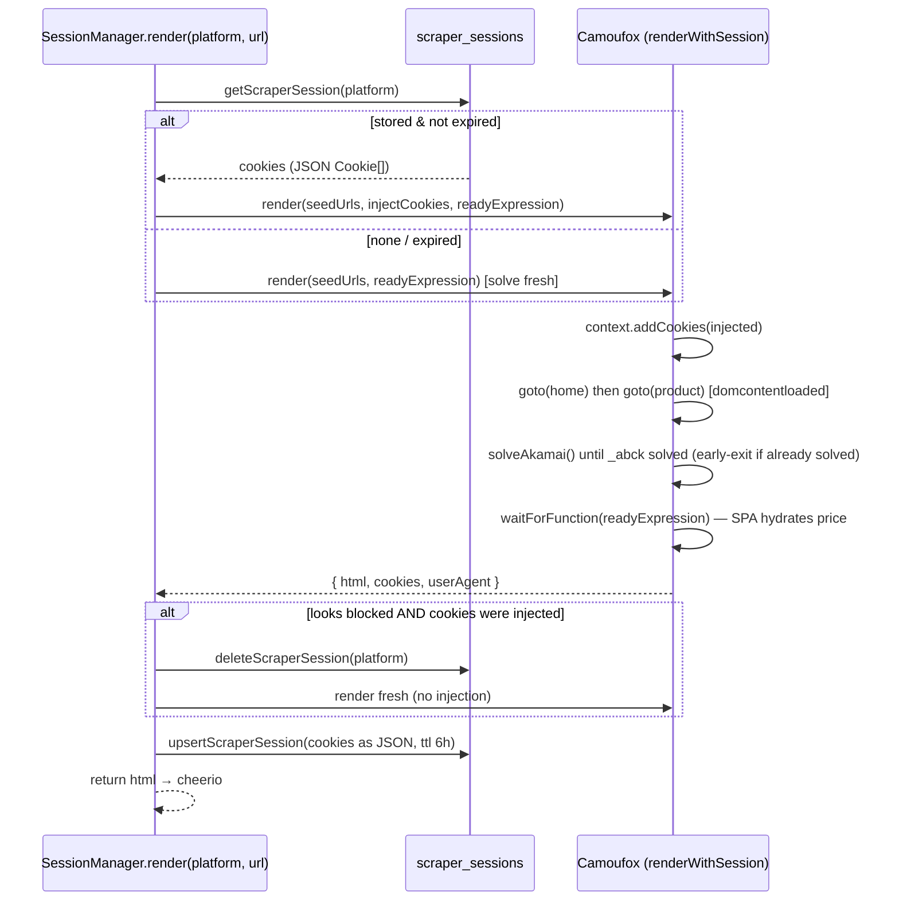

# Session-Based Scraping (Bypassing Akamai)

The "3rd scraping type". Some stores — notably **AJIO** — sit behind **Akamai Bot
Manager**, which rejects *every* bare HTTP fetch. This doc explains how we scrape
them with **Camoufox** (stealth Firefox) plus a **reusable cookie session**.

Relevant code:

- `scrapers/src/scraper/browser.ts` — Camoufox launcher + `renderWithSession()`.
- `scrapers/src/scraper/session-manager.ts` — `SessionManager` (reuse/refresh).
- `scrapers/src/scraper/base.ts` — `fetchPageWithSession()` entry point.
- `shared/src/db/sessions.ts` + `scraper_sessions` table — session persistence.

## Why bare fetches don't work

Empirically proven against AJIO's Akamai:

- **axios / Node HTTP** → blocked (TLS + header fingerprint).
- **curl with real browser headers** → still `403 Access Denied`.
- **Camoufox-solved cookies replayed via curl** → still `403`.
- **The browser's own `context.request.get()`** (browser TLS!) → still `403`.

Conclusion: Akamai requires a **full rendered navigation** (`page.goto()`) to the
product URL. A bare fetch — even with perfect cookies and headers — is refused.
So AJIO must be scraped by *navigating* it in a real (stealth) browser.

## Camoufox instead of Chromium

All browser scraping uses **Camoufox** (`camoufox-js`), a stealth-hardened
Firefox fork with binary-level anti-fingerprinting (canvas/WebGL/navigator
spoofing, human-like cursor movement). It replaces raw Playwright Chromium.

`launchCamoufox()` (`browser.ts`):

```ts
Camoufox({
  headless: resolveHeadless(),  // 'virtual' (Xvfb) | true | false
  humanize: true,               // human cursor movement
  locale: 'en-IN',
  os: ['windows', 'macos'],     // randomized OS fingerprint
})
```

Run mode via `CAMOUFOX_HEADLESS`:

| Value | Behaviour |
|-------|-----------|
| unset / `virtual` | headed Firefox on an **Xvfb** virtual display — **max stealth** (default). camoufox-js spawns/tears down Xvfb itself; only the `xvfb` binary is needed. |
| `true` | pure headless — lighter, use where Xvfb is unavailable |
| `false` | headed on the real display — local debugging |

Rules of thumb (learned the hard way):

- **Don't override `userAgent`/`locale` in `newContext`** — Camoufox owns the
  fingerprint; overriding desyncs the spoof and becomes *more* detectable.
- **Don't set `block_images: true`** — camoufox-js warns it hurts WAF stealth.
- **Never `waitUntil: 'networkidle'` on AJIO** — it never idles (persistent
  connections) and hangs to timeout. Use `'domcontentloaded'`.
- `camoufox-js` is **ESM-only and heavy**, so it is imported **lazily** (dynamic
  `import()` inside `launchCamoufox`) to keep the browser-free scraper tests
  running under Jest/CJS.

## How a session scrape works



### 1. Cookie reuse (the optimization)

`SessionManager.render()`:

1. Reads the stored session for the platform. If present and not past its TTL
   (`expiresAt`), its cookies are **injected** into a fresh Camoufox context via
   `context.addCookies`.
2. Calls `renderWithSession()` with those cookies. If Akamai's `_abck` is already
   in a solved state from the injected cookies, the solve loop **exits
   immediately** — no expensive re-solve.
3. Persists the (possibly refreshed) cookies back with a new 6h TTL.

### 2. Solving Akamai (`solveAkamai`)

When cookies are missing/stale, Akamai's `_abck` starts unsolved. We drive it to
its solved state by **simulating human activity** (`simulateHumanActivity`:
mouse moves + wheel scrolls) and polling the cookie jar:

- `_abck` is **solved** when its `~`-split state segment is not `-1`
  (`isAbckSolved`). Typically reached after a few interactions over ~10–25s.
- The loop has a ~25s deadline; worst case it re-solves rather than fails.

### 3. Extraction readiness (`readyExpression`)

AJIO is a SPA: at `domcontentloaded` the HTML is present but
`window.__PRELOADED_STATE__.product.productDetails.price` is not yet hydrated.
`renderWithSession` therefore `page.waitForFunction(readyExpression)` until the
price populates before capturing `page.content()`. For AJIO the expression checks
`window.__PRELOADED_STATE__.product.productDetails.price` exists.

### 4. Block detection + one fresh retry

If a render using **injected** cookies comes back looking blocked
(`Access Denied` / `Pardon Our Interruption` / a suspiciously small body via
`looksBlocked`), the session is deleted and the render is retried **once**
completely fresh (no injection → full solve).

## Per-platform config

Registered in `session-manager.ts` `CONFIGS`:

```ts
ajio: {
  seedUrls: (target) => ['https://www.ajio.com', target], // warm the domain, then the product
  cookieDomain: 'ajio.com',        // only persist cookies for this domain
  ttlMs: 6 * 60 * 60 * 1000,       // reuse a session for 6h before refresh
  readyExpression: '!!(window.__PRELOADED_STATE__ ... .price)',
}
```

Adding another Akamai-gated store = add a `CONFIGS[platform]` entry + set that
platform's `fetchMethod: "session"` in `selectors.json` + call
`fetchPageWithSession(url, platform)` from its scraper's `fetchPage`.

## Persistence: `scraper_sessions`

One row per platform (see [db-structure.md](./db-structure.md)):

- `cookie` — **JSON array of Playwright cookie objects** (the render approach).
  (Older curl-string rows are ignored/re-solved gracefully.)
- `user_agent`, `headers` — retained from the legacy curl replay path; vestigial
  for the render approach.
- `expires_at` — TTL boundary that gates reuse vs. fresh solve.

## Performance

- **First solve:** ~30–60s (full navigation + human-activity solve + hydration).
- **Reused session:** **~6–7s** (cookies injected, no re-solve).

Log lines to look for:

```
[session] ajio: reusing stored session (36 cookies)
[session] ajio: no valid stored session — solving fresh
[session] ajio: reused session blocked — re-solving fresh
```

## <a name="testing"></a> Testing

Camoufox needs Firefox system libs, which are installed in the Docker image (not
necessarily on a bare local host). Test AJIO end-to-end against the running
stack:

```bash
# First call solves fresh (~30-60s); a second call should reuse cookies (~6-7s)
curl -s -X POST localhost:5001/scrape \
  -H 'content-type: application/json' \
  -d '{"url":"https://www.ajio.com/<product>/p/<id>"}'
```

Expect JSON with `price`, `title`, `thumbnailUrl`, `available`, `category`. Run
the full Jest suite inside the container so the browser test (`blinkit`) has its
runtime:

```bash
docker compose exec scrapers npx jest --config jest.config.ts
```

## Docker prerequisites

The `Dockerfile` provisions Camoufox: `CAMOUFOX_INSTALL_DIR=/opt/camoufox`,
`playwright install-deps firefox`, `apt-get install xvfb`, and a
`camoufox-js fetch` to download the browser (~663MB + GeoIP). See the `Dockerfile`
and `.env.example` (`CAMOUFOX_HEADLESS`, `CAMOUFOX_INSTALL_DIR`).
