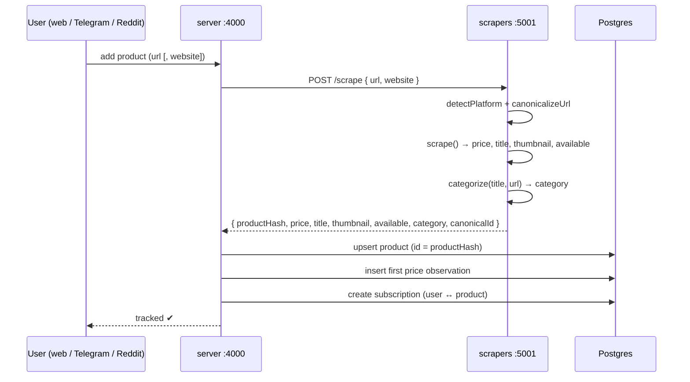
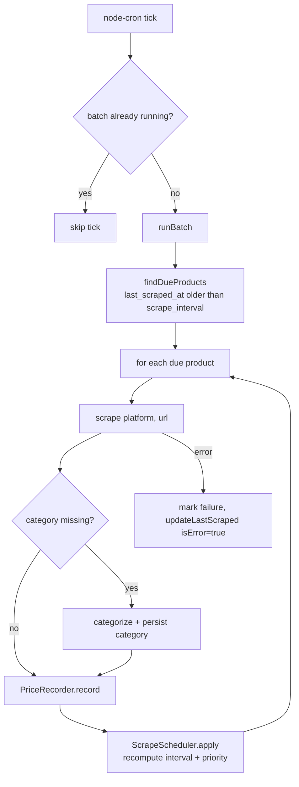
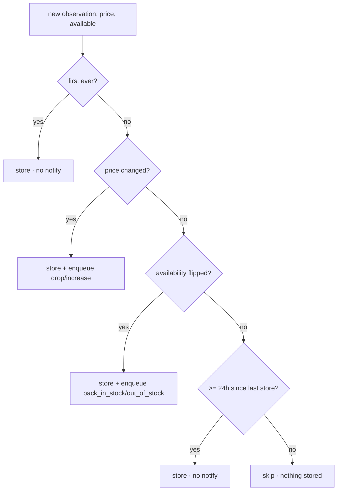
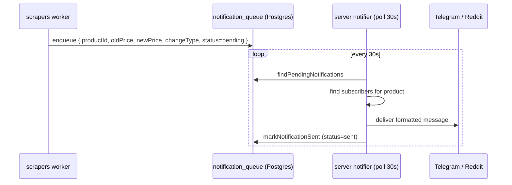

# Workflow Architecture

This document traces the three runtime flows that make the system work:

1. [Adding a tracker](#1-adding-a-tracker) (user tracks a product)
2. [The scheduled scrape loop](#2-the-scheduled-scrape-loop) (keeping prices fresh)
3. [Notification delivery](#3-notification-delivery) (telling users about changes)

All three meet at Postgres — it is the queue, the cache, and the source of truth.

---

## 1. Adding a tracker

Triggered from the web app (`POST /api/subscriptions`), the Telegram bot, or a
Reddit DM. The server owns identity and persistence; the scrapers service owns
the actual page fetch.

Key points:

- **Product identity is a hash.** `productHash = sha256({ website, canonicalId })`
  truncated to 8 chars, computed in the scrapers service (`src/http.ts`). Two
  users tracking the same product share **one** `products` row — scraping happens
  once for everyone.
- **`canonicalizeUrl`** strips tracking params / variants down to a stable
  `platform:productId` (e.g. `amazon:B0XXXX`) so different URLs for the same item
  dedupe correctly.
- **The server never launches a browser.** It delegates the fetch to the scrapers
  service via `src/services/scraperClient.ts`. This keeps the heavy
  Camoufox/Firefox runtime out of the API process.
- **Rate limit.** A user may track at most `MAX_TRACKERS_PER_USER` (20) products
  and create `MAX_CUSTOM_LISTS` (3) lists — enforced in the subscription/list
  services (`shared/src/limits.ts`).

---

## 2. The scheduled scrape loop

The scrapers service runs an in-process `node-cron` job every minute
(`SCRAPE_CRON`, default `* * * * *`). Each tick runs one batch, guarded so
batches never overlap (`src/index.ts` → `safeRunBatch`).

### 2a. Due selection

`findDueProducts()` (`shared/src/db/products.ts`) returns products that either
have never been scraped or whose `last_scraped_at` is older than their
per-product `scrape_interval` (seconds). Only products with at least one
subscriber are considered (join on `subscriptions`).

### 2b. Store-or-skip decision (`PriceRecorder`)

`src/price-recorder.ts` decides whether the fresh observation is persisted.
An observation is **stored** when any of these hold:

- it is the **first** observation for the product, **or**
- the **price changed**, **or**
- **availability flipped** (in ↔ out of stock), **or**
- **≥ 24h** elapsed since the last stored observation (a silent "keep-alive"
  sample so analytics/charts stay continuous even on flat prices).

Only genuine price changes and availability flips enqueue a notification; the
24h keep-alive is analytics-only and never messages the user.

### 2c. Adaptive rescheduling (`ScrapeScheduler`)

After recording, `src/scheduler.ts` recomputes the product's `scrape_interval`
from its **category base interval** adjusted by recent **price-change history**,
then persists it so the next `findDueProducts` picks it at the right cadence. See
[categorizer.md](./categorizer.md) for the full cadence table and rationale.

---

## 3. Notification delivery

Scraping and delivery are **decoupled through a durable outbox** so a slow or
failing channel never blocks scraping, and messages survive restarts.

- **Producer:** the scrapers worker (`PriceRecorder`) writes rows into
  `notification_queue` with `status = 'pending'` and a `changeType` of
  `drop | increase | back_in_stock | out_of_stock`.
- **Consumer:** the server's notification poller
  (`server/src/services/notifier.ts`) polls every 30s, resolves subscribers for
  the product, formats a per-channel message (₹ amounts + % change), delivers via
  the Telegram/Reddit bots, and marks the row `sent`.
- **Fan-out:** one product row can have many subscribers; each subscriber's
  configured channel(s) receive the message. Per-subscription `alertPrice` and
  `notifyEveryChange` refine who is notified.

---

## Service topology & env

| Service | Command | Port | Purpose |
|---------|---------|------|---------|
| `postgres` | — | 5432 | Source of truth |
| `migrate` | `tsx shared/src/db/migrate.ts` | — | Applies Drizzle migrations, then exits; app waits on success |
| `app` (server) | `tsx server/server.ts` | 4000 | REST API, bots, notifier, static web |
| `scrapers` | `tsx scrapers/src/index.ts` | 5001 | `/scrape` + cron worker |

Cross-service config: `SCRAPER_URL` (server → scrapers), `DATABASE_URL` (all),
`SCRAPE_CRON` / `SCRAPER_PORT` (scrapers). See `.env.example`.

## Failure handling

- **Scrape failure:** `updateLastScraped(id, isError=true)` bumps `failure_count`
  in `product_metrics`; the batch continues with the next product.
- **Session expiry (AJIO):** handled inside the scraper via Camoufox re-solve —
  see [session-scraper.md](./session-scraper.md).
- **Overlapping batches:** prevented by the `batchRunning` guard in `index.ts`.
- **Delivery failure:** the queue row stays `pending` and is retried on the next
  poll (delivery is idempotent per row via `status`).
